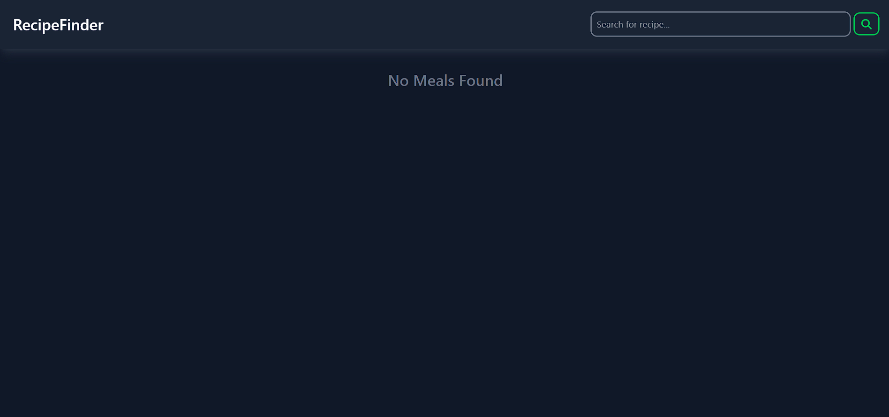
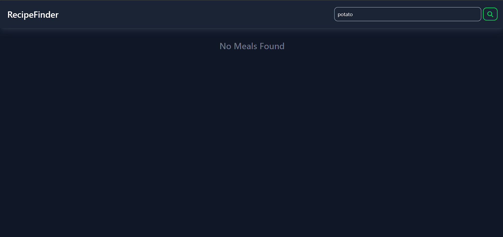
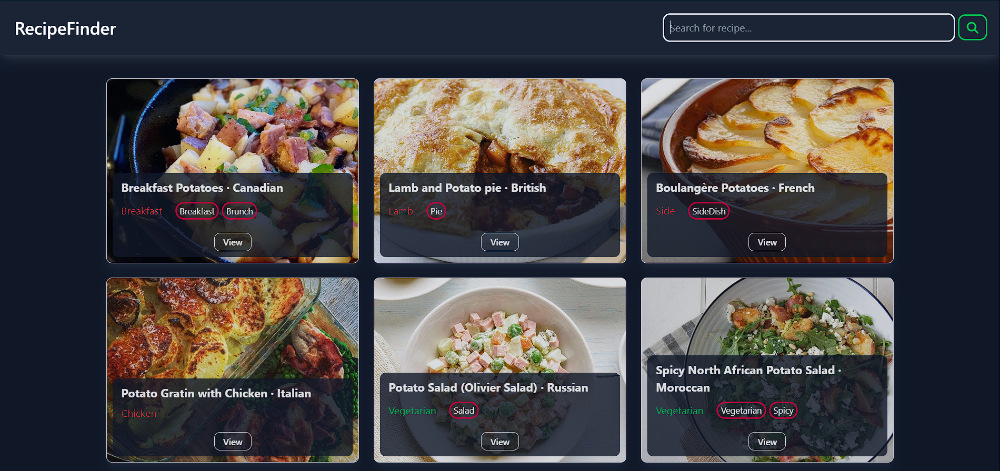
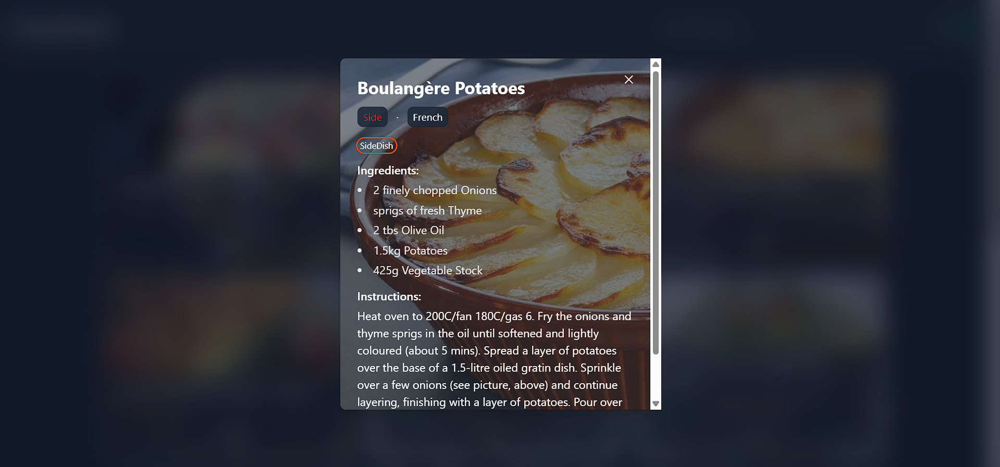
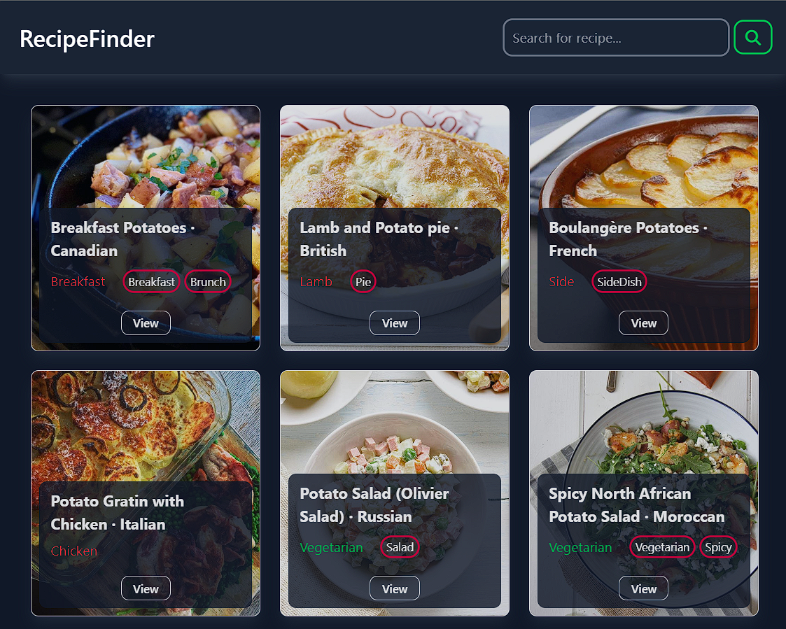
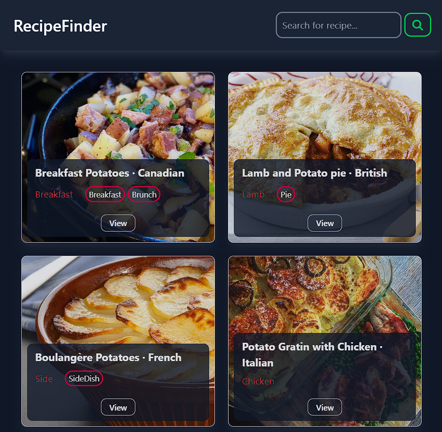
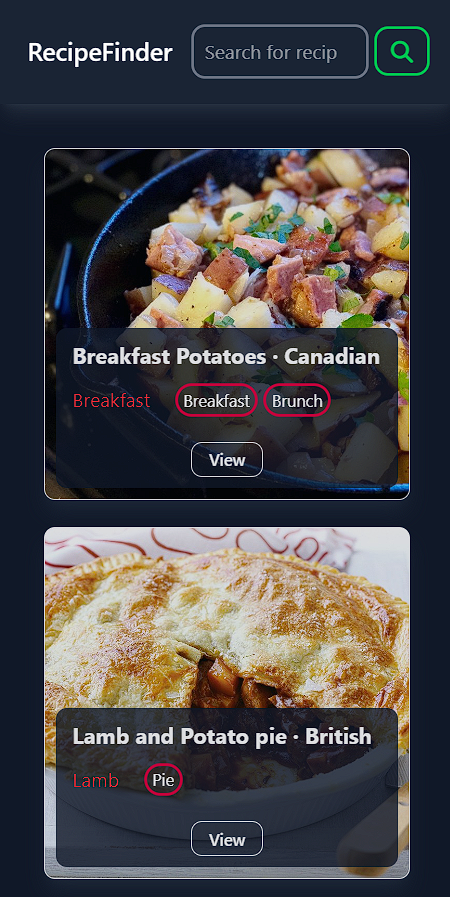
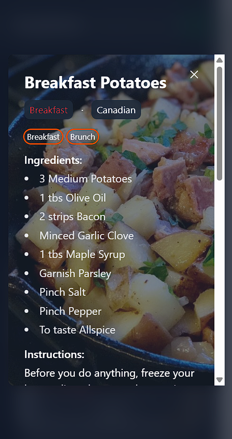

## Recipe Finder App

A fast, minimal web app to search recipes and view details (ingredients and instructions) using TheMealDB API. Built with plain HTML, CSS (Tailwind CDN), and JavaScript—no build step required.

### Features

- **Search recipes** by name
- **Responsive grid** of recipe cards
- **Modal details**: ingredients, instructions, tags, area, category
- **Loading state** and empty results message
- **Keyboard-friendly**: close modal via the close button

### Tech Stack

- **Frontend**: HTML, Tailwind (via CDN), Font Awesome (via CDN)
- **Language**: Vanilla JavaScript
- **API**: [TheMealDB](https://www.themealdb.com/api.php)

### Getting Started

1. Clone or download this repository.
2. Open `index.html` directly in your browser, or use a simple static server (recommended):

```bash
# Using VS Code Live Server (recommended)
# Right-click index.html → "Open with Live Server"

# Or use any static server, e.g.:
npx serve .
```

No environment variables or build steps are needed.

### Usage

1. Enter a recipe name (e.g., "potato") in the search bar.
2. Press the search button.
3. Click "View" on any result to open the modal with full details.
4. Use the close button in the top-right of the modal to exit.

### Screenshots

Place images in `assets/` and reference them with relative paths:

### 🖼 Screenshots

<div align="center">
  
**Home Page**
</div>

---

<div align="center">
  
**Searching Recipes**
</div>

---

<div align="center">
  
**Searced Recipes Result**
</div>

---
<div align="center">
  
**Recipe Modal**
</div>

---

<div align="center">
  
**Searced Recipes Result - laptop view**
</div>

---

<div align="center">
  
**Searced Recipes Result - tablet view**
</div>

---

<div align="center">
  
**Searced Recipes Result - phone view**
</div>

---

<div align="center">
    
**Recipe Modal - phone view**
</div>

---

### Project Structure

```text
Recipe-Finder-App/
├─ index.html     # App layout and containers
├─ index.js       # Search, render, and modal logic
├─ style.css      # Additional styles (Tailwind provided via CDN)
└─ README.md
```

### API Reference

- Search endpoint used: `https://www.themealdb.com/api/json/v1/1/search.php?s={query}`
- Results are parsed and rendered as cards; clicking "View" shows a modal with ingredients and instructions.

### Notes & Limitations

- Results depend on TheMealDB data availability and uptime.
- Category color indicator is basic (Vegetarian/Dessert highlighted; others default).

### Accessibility

- High-contrast theme with Tailwind classes.
- Modal provides a clear close button. (Enhancements like ESC-to-close and focus trapping can be added.)

### Roadmap (Nice-to-have)

- ESC key to close modal and focus management
- Persist last search query
- Offline error handling and retries
- Unit tests for rendering functions

### Credits

- Data: [TheMealDB](https://www.themealdb.com)
- UI: Tailwind CSS CDN, Font Awesome CDN

### License

This project is open source and available under the MIT License.
